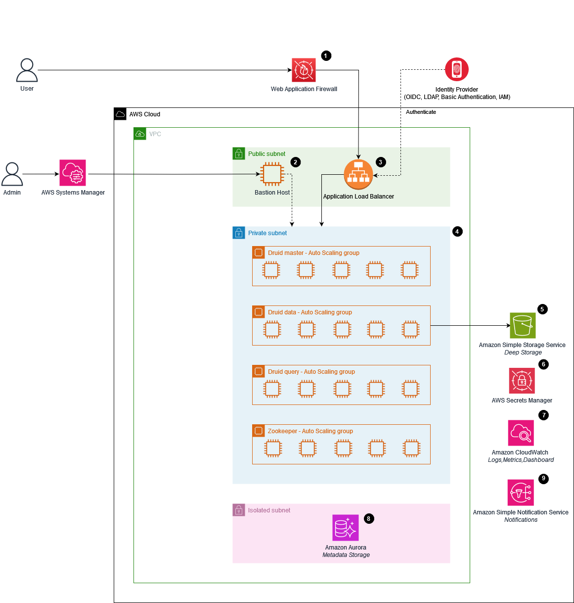

### Table of contents

-   [Scalable Analytics using Apache Druid on AWS](#scalable-analytics-using-apache-druid-on-aws)
-   [Licence](#licence)
-   [About this solution](#about-this-solution)
    -   [Solution overview](#solution-overview)
    -   [Benefits](#benefits)
-   [Architecture overview](#architecture-overview)
    -   [Architecture reference diagram](#architecture-reference-diagram)
    -   [Solution components](#solution-components)
-   [Prerequisites](#prerequisites)
    -   [Build environment specifications](#build-environment-specifications)
    -   [AWS account](#aws-account)
    -   [Tools](#tools)
-   [How to build and deploy the solution](#how-to-build-and-deploy-the-solution)
    -   [Configuration](#configuration)
    -   [Build and deploy](#build-and-deploy)
-   [Access the druid web console](#access-the-druid-web-console)
-   [Uninstall the solution](#uninstall-the-solution)
-   [Collection of operational metrics](#collection-of-operational-metrics)

---

## Scalable Analytics using Apache Druid on AWS

Scalable analytics using Apache Druid on AWS is a solution offered by AWS that enables customers to quickly and efficiently deploy, operate and manage a cost-effective, highly available, resilient, and fault tolerant hosting environment for Apache Druid analytics databases on AWS.

## Licence

Licensed under the Apache License Version 2.0 (the "License"). You may not use this file except in compliance with the License. A copy of the License is located at

    http://www.apache.org/licenses/

or in the "license" file accompanying this file. This file is distributed on an "AS IS" BASIS, WITHOUT WARRANTIES OR CONDITIONS OF ANY KIND, express or implied. See the License for the specific language governing permissions and limitations under the License.

## About this solution

The solution incorporates an [AWS CDK](https://aws.amazon.com/cdk/) construct that encapsulates Apache Druid and is purposefully architected to be easy to operate, secure by design, and well-architected. With this solution, you can establish an Apache Druid cluster for data ingestion and analysis within a matter of minutes. It also provides deployment flexibility by supporting Amazon EC2, Amazon Elastic Kubernetes Service (EKS), and EKS Fargate options, enabling you to run Apache Druid on EC2, EKS, or EKS Fargate as per your preference.

You can use this README file to find out how to build, deploy, use and test the code. You can also contribute to this project in various ways such as reporting bugs, submitting feature requests or additional documentation. For more information, refer to the [Contributing](CONTRIBUTING.md) topic.

## Solution overview

Scalable analytics using Apache Druid on AWS helps organizations utilize the full suite of features and capabilities of this powerful open source analytics engine, while leveraging the flexibility, elasticity, scalability and price performance options of AWS’s compute and storage offerings, for their real-time, low-latency analytics processing use cases.

This solution is intended for deployment in an enterprise by IT infrastructure and cloud engineering teams, database administrators, and developers who have practical experience with the AWS Cloud.

### Benefits

1. **High Customizability**: The solution provides a high degree of customization options. Users can choose different compute types, such as EC2, EKS, or Fargate, allowing them to select the most suitable infrastructure for their specific needs. Additionally, it supports various EC2 instance types, including Graviton instances, and offers flexibility in selecting database services, like Aurora PostgreSQL, Aurora PostgreSQL Serverless, or bringing your own database. Customers have the freedom to fine-tune Druid configuration parameters to meet their requirements precisely.

1. **High Availability and Resiliency**: The solution ensures high availability and resiliency through features like autoscaling with customizable policies, and distributing Druid nodes across multiple availability zones. It also supports cluster recreation from metadata store and deep storage backups, ensuring data is protected and available even in the face of unexpected failures.

1. **High Security Standards**: Security is a top priority with the solution. It offers encryption in transit and encryption at rest with the ability to bring your own keys (BYOK). The use of a private Application Load Balancer (ALB) ensures that Druid APIs remain inaccessible from the public internet, enhancing security. Additionally, multiple authentication schemes, including basic authentication and OAuth2/OIDC, enable users to implement robust security measures.

1. **Operational Excellence**: To facilitate operational excellence, the solution includes a CloudWatch dashboard and alarms for monitoring Druid clusters. This ensures that administrators can keep a close eye on the health and performance of their clusters. Moreover, it supports the publishing of metrics to third-party monitoring tools via StatsD, enabling integration with a wide range of external monitoring and alerting systems.

### Use cases

Apache Druid is a database that is most often used for powering use cases where real-time ingest, fast query performance, and high uptime are important. As such, Druid is commonly used for powering GUIs of analytical applications, or as a backend for highly-concurrent APIs that need fast aggregations.

Common application areas for Druid include:

-   Clickstream analytics (web and mobile analytics)
    Risk/fraud analysis
-   Network telemetry analytics (network performance monitoring)
-   Server metrics storage
-   Supply chain analytics (manufacturing metrics)
-   Application performance metrics
-   Business intelligence / OLAP

---

## Architecture overview

### Architecture reference diagram

The following diagram represents the solution's architecture design for EC2 stack.



For the architecture of EKS stack, please refer to the diagram located at `source/images/solution_architecture_diagram-eks.png`.

### Solution components

The solution deploys the following components that work together to provide a production-ready Druid cluster:
-   **Web application firewall**: AWS WAF is utilized to safeguard Druid web console and Druid API endpoints from prevalent web vulnerabilities and automated bots that could potentially impact availability, compromise security, or overutilize resources. It is automatically activated when the `internetFacing` parameter is set to true.

-   **Application load balancer**: A load balancer serves as the single point of contact for clients. The load balancer distributes incoming application traffic across multiple query servers in multiple Availability Zones.

-   **Druid master auto scaling group**: An Auto Scaling group contains a collection of Druid master servers. A Master server manages data ingestion and availability: it is responsible for starting new ingestion jobs and coordinating availability of data on the "Data servers". Within a Master server, functionality is split between two processes, the Coordinator and Overlord.

-   **Druid query auto scaling group**: An Auto Scaling group contains a collection of Druid query servers. A Query server provides the endpoints that users and client applications interact with, routing queries to Data servers or other Query servers. Within a Query server, functionality is split between two processes, the Broker and Router.

-   **Druid data auto scaling group**: An Auto Scaling group contains a collection of Druid data servers. A Data server executes ingestion jobs and stores queryable data. Within a Data server, functionality is split between two processes, the Historical and MiddleManager.

-   **ZooKeeper auto scaling group**: An Auto Scaling group contains a collection of ZooKeeper servers. Apache Druid uses Apache ZooKeeper (ZK) for management of current cluster state.

-   **Aurora based metadata storage**: An Aurora PostgreSQL database cluster provides the metadata storage to Apache Druid cluster. Druid uses the metadata storage to house various metadata about the system, but not to store the actual data.

-   **S3 based deep storage**: An Amazon S3 bucket that provides deep storage to Apache Druid cluster. Deep storage is where segments are stored.

-   **Application secrets**: Secrets manager stores the secrets used by Apache Druid including RDS secret, admin user secret etc.

-   **Logs, metrics, and dashboards**: Logs, metrics, and dashboards are supported in CloudWatch.

-   **Notifications**: The notification system, powered by Amazon Simple Notification Service (Amazon SNS), delivers alerts or alarms promptly when system events occur. This ensures immediate awareness and action when needed.

-   **Bastion host**: A security hardened Linux server used to manage access to the Druid servers running in private network from an external network. It can also be used to access Druid web console through SSH tunneling in the case where private ALB is deployed.

---

## Prerequisites

### Build environment specifications

-   To build and deploy this solution, we recommend using Ubuntu with minimum 4 cores CPU, 16GB RAM. Mac(Intel) or other Linux distributions are also supported.
-   The computer used to build the solution must be able to access the internet.

### AWS account

-   **A CDK bootstrapped AWS account**: You must bootstrap your AWS CDK environment in the target region you want to deploy, using the AWS CDK toolkit's cdk bootstrap command. From the command line, authenticate into your AWS account, and run `cdk bootstrap aws://<YOUR ACCOUNT NUMBER>/<REGION>`. For more information, refer to the [AWS CDK's How to bootstrap](https://docs.aws.amazon.com/cdk/v2/guide/bootstrapping.html) page.

### Tools

-   The latest version of the [AWS CLI](https://aws.amazon.com/cli/), installed and configured.
-   The latest version of the [AWS CDK](https://docs.aws.amazon.com/cdk/latest/guide/home.html).
-   [Nodejs](https://docs.npmjs.com/getting-started) version 18 or newer.
-   [Git](https://git-scm.com/) command line
-   Java Runtime
    -   The solution requires a Java 8 Runtime. We strongly recommend using [Amazon Corretto 8](https://docs.aws.amazon.com/corretto/latest/corretto-8-ug/downloads-list.html). Alternatively, you can also use other OpenJDKs such as [Eclipse Temurin](https://adoptium.net/en-GB/temurin/releases/?version=8).
-   [Maven](https://maven.apache.org/install.html.) (>=3.5.2)
    -    We recommend configuring Maven to use an OpenJDK8 compatible JAVA version, such as Amazon Corretto 8.
-   [Docker](https://docs.docker.com/get-docker/)
-   [Curl](https://curl.se/download.html)

---

## How to build and deploy the solution

Before you deploy the solution, review the architecture and prerequisites sections in this guide. Follow the step-by-step instructions in this section to configure and deploy the solution into your account.

Time to deploy: approximately 40 minutes

### Configuration

Use the `source/cdk.json` file to configure the solution. It is recommended to copy from a cdk.json example in the `source/quickstart` folder based on the deployment platform, and make changes to suit your use cases accordingly.

**AMI configuration (optional)**

The `EC2` hosting option by default provisions EC2 instances with Amazon Linux 2. This can be overriden by specifying the `customAmi` object in the `cdk.json` file. This object should provide the AMI name and owners' account IDs or alias that `cdk` would use to perform an AMI lookup. Depending on the instance types utilized in the cluster, please supply the corresponding AMI for "arm64" (Graviton instances) or "amd64" (x86-based instance types). The solution has been tested with Amazon Linux, Ubuntu 20.04 LTS and Ubuntu 22.04 LTS.

```
"customAmi": {
    "arm64": {
        "name": "ubuntu/images/hvm-ssd/ubuntu-focal-20.04-arm64-server*",
        "owners": ["amazon"]
    },
    "amd64": {
        "name": "ubuntu/images/hvm-ssd/ubuntu-focal-20.04-amd64-server*",
        "owners": ["amazon"]
    }
},
```

**Data retention policy configuration (optional)**

By default, all solution data (S3 buckets, Aurora DB instances, Aurora DB snapshots etc.) will be kept when you uninstall the solution. To remove this data, in the configuration file, set the `retainData` flag to `false`. You are liable for the service charges when solution data is retained in the default configuration.

```
"retainData": false,
```

**Network configuration (optional)**

-   VPC Configuration

    -   VPC CIDR Range

        -   By default the solution would create a new VPC for deployment with default CIDR range as 10.120.0.0/16. However, this can be overridden using below configuration:
            ```
            "vpcCidr": "x.x.x.x/x",
            ```

    -   VPC ID

        -   This solution also offers the capability to deploy to an existing VPC. To accomplish this, you can utilize the following configuration options:

            ```
            "vpcId": "vpc-xxxxxxxxxxxxxxxxx"
            ```

-   Application Load Balancer setting

    -   The solution will provision an application load balancer or ALB which helps to route requests to Druid query instances. It supports both internet facing and private options as follows:
        ```
        "internetFacing": true,
        ```
        The default setting is for a private Application Load Balancer (ALB) to be created. To access this private ALB, you can either use an AWS VPN or SSH tunneling via a bastion host. However, if the internetFacing parameter is set to true, the ALB will be publicly available. In such cases, you can use AWS WAF (Web Application Firewall) with your ALB to allow or block requests based on rules in a web access control list (web ACL).

-   Bastion Host
    -   A bastion host can be launched in the public subnet using the below configuration which can facilitate the access to the hosts and services running in private and isolated subnets.
        ```
        "bastionHost": true,
        ```

**Druid domain configuration (optional)**

This solution can seamlessly integrate with Amazon Route53 to automate the creation of domains, streamlining access to the Druid web console and API endpoints.

With the following Route53 configuration, this solution will automatically create a Route53 domain using the specified `druidDomain` in the supplied hosted zone. In addition, this solution will create a certificate in AWS Certificate Manager (ACM) and associate it with the Application Load Balancer (ALB) to enable secure HTTPS communication.

-   Route53 hosted zone configuration
    ```
    "route53HostedZoneName": "<The hosted zone name in Route 53. eg. example.com>",
    "route53HostedZoneId": "<The hosted zone ID in Route 53. eg. Z03935053V8YUTYYYEXXX>",
    ```

-   Druid domain configuration
    ```
    "druidDomain": "<A full domain address. eg. druid.example.com>"
    ```

If none of the aforementioned configurations are set up,, the solution will assign a generic Application Load Balancer (ALB) domain name for your Druid cluster which will expose HTTP protocol only. You also have the flexibility to set up the domain outside of the solution. In such case, you must configure the TLS certificate and the `druidDomain` to facilitate secure HTTPS access to the Druid cluster after the domain has been successfully set up.
-   TLS certficate configuration
    ```
    "tlsCertificateArn": "<The ARN of ACM certificate>"
    ```

**FIPS 140-2 configuration (optional)**

The Federal Information Processing Standard ([FIPS](https://aws.amazon.com/compliance/fips/) ) Publication 140-2 is a US and Canadian government standard that specifies the security requirements for cryptographic modules that protect sensitive information. If you require to use of FIPS 140-2 validated cryptographic modules, this can be set using below configuration:

```
"useFipsEndpoint": true,
```

**Self-managed druid installation bucket asset (optional)**

By default, the solution will upload druid binary, extension, config and scripts to s3 bucket automatically, optionally you can manage these assets yourself by using below configuration

```
"selfManageInstallationBucketAssets": true,
```
When this option is enabled, you will need to manually upload assets in the following folders to s3 bucket after you `npm run build`
```
source/lib/uploads/scripts/ -> bootstrap-s3-bucket-installation/scripts/
source/lib/docker/extensions/ -> bootstrap-s3-bucket-installation/extensions/
source/lib/uploads/config/ -> bootstrap-s3-bucket-installation/config/
source/lib/docker/ca-certs/ -> bootstrap-s3-bucket-installation/ca-certs/
source/druid-bin/ -> bootstrap-s3-bucket-installation/druid-images/
source/zookeeper-bin/ -> bootstrap-s3-bucket-installation/zookeeper-images/
```

**Identity provider configuration (optional)**
The default setup of this solution activates basic authentication, enabling access to the Druid web console and API through a username and password. Additionally, you have the option to enable user access federation through a third-party identity provider (IdP) that supports OpenID Connect authentication. If you have an existing enterprise Identity Provider, you can seamlessly integrate it using the CDK configuration outlined below.

```
"oidcIdpConfig": {
    "clientId": "<OIDC IDP client ID>",
    "clientSecretArn": "<The ARN of the secret in AWS secret manager which stores the client secret and cookiePassphrase.>",
    "discoveryURI": "<OIDC IDP client discovery URI. e.g. https://dev-pkaccwqn.us.auth0.com/.well-known/openid-configuration>",
    "groupClaimName": "<OIDC claim name that contains the group name list that the user belongs to>",
    "groupRoleMappings": {
        "<groupName>": ["<roleName>", ...],
    }
}
```

The client secret should consist of the following two fields:
```
clientSecret: <the secret code for the OIDC IDP client, which is typically generated by the OIDC IDP.>
cookiePassphrase: <a password that uses a mix of letters and numbers in plain text form.>
```

Example: Identity provider configuration to federate through Amazon Cognito.
```
"oidcIdpConfig": {
    "clientId": "<OIDC IDP client ID>",
    "clientSecretArn": "arn:aws:secretsmanager:<region>:<account>:secret:<secret-name>-<random-6-characters>",
    "discoveryURI": "https://cognito-idp.<region>.amazonaws.com/<user pool id>/.well-known/openid-configuration",
    "groupClaimName": "cognito:groups",
    "groupRoleMappings": {
        "developers": ["administrator"],
        "scrum-masters": ["read"]
    }
}
```

It is important to note that the redirect URI on the IDP side should be configured as https://<druid_domain>/druid-ext/druid-oidc/callback.

**Druid configuration**

-   **Druid version**: Apache Druid release version (eg. 27.0.0) that you want to run. It is recommended to use the latest stable [Druid version](#https://druid.apache.org/downloads.html).

    ```
    "druidVersion": "27.0.0",
    ```

-   **Druid cluster name**: A sequence of ASCII characters that uniquely identifies each Druid cluster. If there are multiple deployments, please make sure that you have an unique cluster name for each cluster. The cluster name will be appended to the CloudFormation stack name.

    ```
    "druidClusterName": "dev",
    ```

-   **Druid operation platform**: The intended computing service for hosting a Druid cluster currently has two options available: ec2 and eks. Choosing ec2 would mean that the solution will be deployed on Amazon EC2 hosts, while selecting eks would mean that the solution will be deployed on Amazon EKS.

    ```
    "druidOperationPlatform": "ec2",
    ```

-   **Druid custom IAM policy list (optional)**: By default, this solution creates an IAM role that gives Druid components the minimum permissions they need to function. You can also extend this role with additional permissions by using the following configuration:

    ```
    "druidInstanceIamPolicyArns": ["The ARN of custom IAM policy"...]
    ```

-   **Druid query concurrency rate limit (optional)**: The maximum number of concurrent queries that the Druid cluster can handle. The default value is 100. This parameter sets `druid.broker.http.numConnections` on the broker nodes and `druid.server.http.numThreads` on the historical nodes. In a cluster with 2 broker nodes and the default value of 100, `the druid.server.http.numThreads` parameter on the historical nodes will be set to 100, while the `druid.broker.http.numConnections` parameter on the broker nodes will be set to 50. This configuration ensures that the `druid.server.http.numThreads` value must be equal to or higher than the sum of `druid.broker.http.numConnections` across all the Brokers in the cluster. If you wish to customize this default configuration, you can override the values accordingly using the following configuration:

    ```
    "druidConcurrentQueryLimit": number
    ```

-   **Druid extensions**: A list of Druid extensions to load into the cluster. To load the core extensions for Druid, you have the option to modify the list by adding or removing extensions from it. If you wish to load any custom extensions that you have developed in-house, please ensure that the artifacts for those extensions (such as Java JAR files) are also copied into the `source/lib/docker/extensions` folder. To reduce the configuration overhead, the solution will automatically incorporate the extensions : `druid-oidc`, `druid-cloudwatch`, `druid-basic-security`, `druid-s3-extensions`, `postgresql-metadata-storage`, and `simple-client-sslcontext` to the user provided extension list.
    -   Druid extensions example
        ```
        "druidExtensions": [
            "druid-hdfs-storage",
            "druid-kafka-indexing-service",
            "druid-kinesis-indexing-service",
            "druid-avro-extensions",
            "druid-parquet-extensions",
            "druid-protobuf-extensions",
            "druid-orc-extensions"
        ],
        ```

-  **Druid common runtime properties customisation (optional)**: By default, the solution features a `common.runtime.properties` file located within the `source/lib/uploads/config/_common` directory, thoughtfully crafted to cater to the majority of use cases. Nevertheless, you retain the flexibility to customize and override the settings in this file using the CDK configuration as needed.
    - Druid common runtime customisation configuration example
    ```
    "druidCommonRuntimeConfig": {
        "druid.startup.logging.logProperties": false
    }
    ```

-   **Druid retention rules configuration (optional)**: Data retention rules configuration. Your data retention policies specify which data to retain and which data to drop from the cluster. The rule chain is evaluated from top to bottom, with the default rule chain always added at the bottom. Please consult the [guide](https://druid.apache.org/docs/latest/operations/rule-configuration.html) on Druid retention rules for further information. Alternatively, you have the option to utilize the Druid API or the Druid Web Console to configure the retention rules for Druid. Below is an example for Druid retention rules configuration:
    -   Druid retention rules examle
        ```
        "druidRetentionRules": [
            {
                "type": "loadByPeriod",
                "period": "P1M",
                "includeFuture": true,
                "tieredReplicants": {
                    "hot": 3,
                    "_default_tier": 1
                }
            },
            {
                "type": "loadForever",
                "tieredReplicants": {
                    "hot": 1,
                    "_default_tier": 1
                }
            }
        ]
        ```

**Druid metadata store configuration(optional)**

In the default configuration, this solution sets up an Amazon Aurora Serverless v1 cluster, utilizing the PostgreSQL-compatible engine as the metadata store for Druid. However, if you prefer to use an Amazon Aurora cluster as the metadata store, connect to an existing PostgreSQL database, or create the metadata store from a snapshot, you can customize the configuration by applying the following settings:

```
"druidMetadataStoreConfig": {
    // Metadata store type. Acceptable values include aurora, aurora_serverless, or custom.
    "metadataStoreType": "<aurora | aurora_serverless | custom>",

    // The metadata store configuration differs based on the chosen type of metadata store.
    "metadataStoreConfig": {
    },

    // Optional. The configuration for the backup plan determines the frequency and retention policy for the database snapshots.
    "backupPlanConfig" {
        // The cron expression which defines the snapshot frequency. E.g. cron(0 10 * * ? *) which runs at 10:00 am (UTC) every day.
        "scheduleExpression": "<cron expression>",

        // Number of days that the snapshot will be kept
        "deleteAfterDays": number
    }
}
```

-   Create a new Aurora metadata store (recommended)

This section provides instructions for creating a new Aurora metadata store.

```
"druidMetadataStoreConfig": {
    "metadataStoreType": "aurora",
    "metadataStoreConfig": {
        // Optional. Aurora DB instance class type. eg. t3.large
        "rdsInstanceType": string,

        // Optional. Number of DB instances. Default is 2.
        "rdsInstanceCount": number,

        // Optional. The parameter group name for DB instance.
        "rdsParameterGroupName": string,

        // Optional. Aurora PostgreSQL engine version. The default version is 13.6. Please be aware that updating the version of your existing RDS instance will not result in data migration.
        "rdsEngineVersion": string
    }
}
```

Example configuration to create a new Aurora metadata store:
```
"druidMetadataStoreConfig": {
    "metadataStoreType": "aurora",
    "metadataStoreConfig": {
        "rdsInstanceType": "t3.large",
        "rdsInstanceCount": 2,
        "rdsParameterGroupName": "aurora-postgresql13",
        "rdsEngineVersion": "13.6"
    }
}
```

-   Create a new Aurora metadata store from a snapshot

This section provides instructions on how to create a new Aurora metadata store from a snapshot. Please note that the solution will attempt to create two magic users, specifically 'admin' and 'druid_system,' to facilitate its internal operations if these users don't exist in the snapshot. If these users already exist in the snapshot, please start by generating a secret in AWS secrets manager that includes both the username and password, and then proceed to integrate it into the metadata store configuration. If the secrets are encrypted by a KMS key, ensure that the KMS key permits access from Secrets Manager to enable decryption of the secret.

```
"druidMetadataStoreConfig": {
    "metadataStoreType": "aurora",
    "metadataStoreConfig": {
        // Optional. Aurora DB instance class type. eg. t3.large
        "rdsInstanceType": string,

        // Optional. Number of DB instances. Default is 2.
        "rdsInstanceCount": number,

        // The ARN of RDS snapshot
        "rdsSnapshotArn": string,

        // Optional. The ARN of KMS key which is used to encrypt the database. Required if the storage is encrypted with a KMS key.
        "rdsSnapshotEncryptionKeyArn": string,

        // Optional. Required if the snapshot contains 'druid_system' user.
        "druidInternalUserSecretArn": "<The ARN of secret which stores username and password of the druid_system user >",

        // Optional. Required if the snapshot contains 'admin' user.
        "druidAdminUserSecretArn": "<The ARN of secret which stores username and password of the admin user >",

        // Optional. The parameter group name for DB instance.
        "rdsParameterGroupName": string,

        // Optional. Aurora PostgreSQL engine version. The default version is 13.6. Please be aware that updating the version of your existing RDS instance will not result in data migration.
        "rdsEngineVersion": string
    }
}
```

Example configuration to create a metadata store from snapshot:
```
"druidMetadataStoreConfig": {
    "metadataStoreType": "aurora",
    "metadataStoreConfig": {
        "rdsInstanceType": "t3.large",
        "rdsInstanceCount": 2,
        "rdsSnapshotArn": "arn:aws:rds:<region>:<account-id>:cluster-snapshot:<snapshort-name>",
        "rdsSnapshotEncryptionKeyArn": "arn:aws:kms:<region>:<account-id>:key/<key-id>",
        "druidInternalUserSecretArn": "arn:aws:secretsmanager:<region>:<account-id>:secret:<secret-id>",
        "druidAdminUserSecretArn": "arn:aws:secretsmanager:<region>:<account-id>:secret:<secret-id>",
        "rdsParameterGroupName": "aurora-postgresql13",
        "rdsEngineVersion": "13.6"
    }
}
```

-   Bring your own PostgreSQL database for metadata store

This section explains how to use your own PostgreSQL database for the metadata store. Please note that this solution by default will enforce TLS for the database connectivity. If you're using non-public certficates, you will need to ensure the non-public certficates can be validated by the Druid system. 

```
"druidMetadataStoreConfig": {
    "metadataStoreType": "custom",
    "metadataStoreConfig": {
        // The endpoint address of database
        "databaseUri": string,

        // Optional. The listening port of database. Default to be 5432.
        "databasePort": number,

        // Optional. Database name. Default to be DruidMetadata.
        "databaseName": string,

        // The ARN of secret in secrets manager which stores the administrative username and password in JSON format
        // The secret must contain fields namely "username" and "password"
        "databaseSecretArn": string
    }
}
```

Example configuration to connect to an external metadata store:
```
"druidMetadataStoreConfig": {
    "metadataStoreType": "custom",
    "metadataStoreConfig": {
        "databaseUri": "druidec2stack-dev296-druidmetadataconstructaurorac-xxx.cluster-xxx.us-east-1.rds.amazonaws.com",
        "databasePort": 5432,
        "databaseName": "DruidMetadata",
        "databaseSecretArn": "arn:aws:secretsmanager:<region>:<account>:secret:<secret-id>"
    }
}
```

**Druid deep storage configuration (optional)**

By default, this solution will set up an bucket in Amazon S3 for deep storage. However, if you prefer to use your own bucket for deep storage, you can override this default configuration using the configuration below:

```
"druidDeepStorageConfig": {
    // The ARN of S3 bucket to be used as deep storage
    "bucketArn": string,
    // The bucket prefix to be used to store segments
    "bucketPrefix": string,
    // Optional when using SSE-S3. The KMS key to be used to encrypt the data.
    "bucketEncryptionKeyArn": string
}
```

Example deep storage configuration:
```
"druidDeepStorageConfig": {
    "bucketArn": "arn:aws:s3:::<bucket-id>",
    "bucketPrefix": "druid/segments",
    "bucketEncryptionKeyArn": "arn:aws:kms:<region>:<account-id>:key/<key-id>"
}
```

**Druid EC2 configuration (required if druidOperationPlatform is ec2)**

-   **Auto scaling group configuration**

This section provides instructions and details about the auto scaling group configuration for a variety of Druid node types, including master, query, data, historical, middleManager, and ZooKeeper. This solution also fully supports the [service tiering](https://druid.apache.org/docs/latest/operations/mixed-workloads/) functionalities provided by Druid, offering enhanced resource management and optimization. The service tiering feature allows you to create distinct groups of Historicals and Brokers, each responsible for managing queries based on the segments and resource requirements of the query. It covers the following fields for each node type:

```
// Druid node type. Valid values include data, master, query, and zookeeper. In case of service tiering, it also supports data_<tier>, historical_<tier>, middleManager_<tier>
"<Druid node type>": {
    // Minimum number of EC2 instances in the auto scaling group
    "minNodes": number,

    // Optional, maximum number of EC2 instances in the auto scaling group
    "maxNodes": number,

    // Optinal. EBS volume size in GB for the root file system of EC2 instance.
    "rootVolumeSize": number,

    // Optional. The size of EBS volume (GB) utilized for segment caching on historical node. Required if not using storage optimized instance types.
    "segmentCacheVolumeSize": number,

    // EC2 instance type. eg. m5.2xlarge.
    "instanceType": string
}
```

-   **Rolling update policy (optional)**

A rolling update is a deployment strategy that slowly replaces previous versions of an application with new versions of an application by completely replacing the infrastructure on which the application is running. It minimises the impact on application availability and ensuring a smooth transition to the new version. The solution operates on a default process of sequentially replacing the Druid EC2 instances in a specific order: data, query, and master. This replacement process involves terminating the old instance initially, followed by the creation of a new instance. Once the new instance is confirmed to be in a healthy state, the process proceeds to replace the next instance in the specified order. In the event that an instance is deemed unhealthy during the update process, the system will initiate a rollback to the previous version.
You can customize and override the batch size using the following configuration:

```
// Optional. The rollingUpdatePolicy defines how an Auto Scaling group resource is updated.
"rollingUpdatePolicy": {
    // Optional. Number of instances that is going to be replaced in each batch. Default 1.
    "maxBatchSize": number
},
```

-   **Auto scaling policy (optional)**

An auto scaling policy consists of predefined rules and parameters that dictate how the scaling process should occur. These rules are defined by the user based on specific metrics, such as CPU utilization, network traffic, or application-specific performance metrics. In addition to dynamic auto scaling based on real-time metrics, it also offer schedule-based auto scaling.

```
"autoScalingPolicy": {
    "cpuUtilisationPercent": number between [1, 100],
    "schedulePolicies": [
        {
            // A UTC timestamp represented by a cron expression.
            // eg. "0 5 * * *" means 5:00 AM in UTC time
            "scheduleExpression": "<cron expression>",
            "minNodes": number,
            "maxNodes": number
        }
    ],
    "customLifecycleHookParams": {
        "defaultResult": "CONTINUE" or "ABANDON",
        "heartbeatTimeout": number between [30, 7200] 
    }
}
```

-   **Runtime configuration customisation (optional)**

The solution comes pre-configured with Druid, which suits most use cases. However, you have the flexibility to customize the Druid configuration (i.e., runtime.properties) using the following settings:

```
"runtimeConfig": {
    // Druid process type depending on the node type. Valid values include coordinator, overlord, middleManager, historical, router, and broker.
    "<Druid process type>": {
        // The key name of Druid configuration item. eg. druid.server.http.numThreads
        "<druid configuration key>": "<druid configuration value>"
        ...
    },
}
```

Runtime configuration customisation example
```
"runtimeConfig": {
    "historical": {
        "druid.server.http.numThreads": 300
    },
    "middleManager": {
        "druid.server.http.numThreads": 200
    }
}
```

-   **Druid EC2 configuration example**
    ```
    "druidEc2Config": {
        "master": {
            "minNodes": 2,
            "maxNodes": 2,
            "rootVolumeSize": 50,
            "instanceType": "m5.2xlarge"
        },
        "query": {
            "minNodes": 2,
            "maxNodes": 3,
            "rootVolumeSize": 50,
            "instanceType": "m5.2xlarge",
            "autoScalingPolicy": {
                "cpuUtilisationPercent": 60
            }
        },
        "data": {
            "minNodes": 3,
            "maxNodes": 3,
            "rootVolumeSize": 200,
            "segmentCacheVolumeSize": 500,
            "instanceType": "m5d.2xlarge"
        },
        "zookeeper": {
            "minNodes": 3,
            "maxNodes": 3,
            "rootVolumeSize": 50,
            "instanceType": "m5.xlarge"
        }
    }
    ```
    You can find more configuration examples about EC2 configuration in the `source/quickstart` directory.

**Druid EKS configuration (required if druidOperationPlatform is eks)**

The solution will set up a new Amazon EKS cluster in order to serve as the hosting environment for Druid. This section provides instructions on the configuration for the EKS cluster, including node group settings, involves the provisioning of four distinct node groups during deployment: master, query, data, and zookeeper.

-   **EKS cluster configuration**
    ```
    "druidEksConfig": {
        // Kubernetes API server endpoint access. Valid values include PUBLIC, PRIVATE, and PUBLIC_AND_PRIVATE
        "endpointAccess": "PUBLIC",

        // The ARN of IAM role for the EKS cluster master
        "clusterMasterPrincipalArn": "<the ARN of IAM role for the cluster master>",

        // The underlying capacity provider for the EKS cluster. Valid values include ec2 and fargate.
        "capacityProviderType": "<ec2 or fargate>",

        // The capacity provider configuration. It differs based on the chosen capacity provider.
        "capacityProviderConfig": {
        }
    }
    ```

-   **EC2 capacity provider configuration (required if capacityProviderType is ec2)**
    ```
    // Node group name, valid values include master, query, data, and zookeeper. In case of service tiering, data_<tier> is also supported.
    "<nodeGroupName>": {
        // Minimum number of EC2 instances in the node group
        "minNodes": number,

        // Optional. Maximum number of EC2 instances in the node group
        "maxNodes": number,

        // Optional. EBS volume size in GB for the root file system of EC2 instance.
        "rootVolumeSize": number,

        // EBS volume size in GB. Persistent volume for middleManager pods. Only required for middleManager pods.
        "taskCacheVolumeSize": number,

        // EBS volume size in GB. Persistent volume for historical pods. Only required for historical pods.
        "segmentCacheVolumeSize": number,

        // EC2 instance type for the node group.
        "instanceType": string
    },
    ```

-   **Fargate capacity provider configuration (required if capacityProviderType is fargate)**
    ```
    // Druid process name, valid values include coordinator, overlord, middleManager, historical, router, broker, and zookeeper.
    "<druidProcessName>": {
        // Minimum number of kubernetes pods
        "minNodes": number,

        // Optional. Maximum number of kubernetes pods
        "maxNodes": number,

        // Number of vCPUs to assign to each pod. eg. 2 means 2 vCPUs.
        "cpu": number,

        // The amount of memory to assign to each pod. eg. 4Gi means 4GB memory.
        "memory": string
    }
    ```

-   **Druid EKS configuration example (EC2 capacity provider)**
    ```
    "druidEksConfig": {
        "endpointAccess": "PUBLIC",
        "clusterMasterPrincipalArn": "arn:aws:iam::<account id>:role/<role name>",
        "capacityProviderType": "ec2",
        "capacityProviderConfig": {
            "master": {
                "minNodes": 2,
                "maxNodes": 2,
                "rootVolumeSize": 50,
                "instanceType": "m5.2xlarge"
            },
            "query": {
                "minNodes": 2,
                "maxNodes": 2,
                "rootVolumeSize": 50,
                "instanceType": "m5.2xlarge"
            },
            "data": {
                "minNodes": 3,
                "maxNodes": 3,
                "rootVolumeSize": 50,
                "taskCacheVolumeSize": 300,
                "segmentCacheVolumeSize": 500,
                "instanceType": "m5.2xlarge"
            },
            "zookeeper": {
                "minNodes": 3,
                "maxNodes": 3,
                "rootVolumeSize": 50,
                "instanceType": "m5.large"
            }
        }
    }
    ```
    You can find more examples about EKS configuration in the `source/quickstart` directory.

### Build and deploy

1. Open the terminal and navigate to the source directory: `cd source/`
2. Configure the solution in the cdk.json as suggested
3. Install the dependencies: `npm install`
4. Build the code: `npm run build`
5. Deploy the solution: `npm run cdk deploy`

---

## Access the Druid Web Console

1. Find the website URL from deployment output starting with `druid-base-url` and open it in your browser. We recommend using Chrome. You will be redirected to the sign in page that requires username and password.

2. During the deployment process, an administrative user account is created with the username "admin". The password for this account can be retrieved from AWS secrets manager by looking for the entry with description `Administrator user credentials for Druid cluster`. You have the option to use the administrative user account to sign in, or create a new user account with reduced access privileges.

3. After signing in, you can view the Apache Druid web console.

---

## File structure

Upon successfully cloning the repository into your local development environment but prior to running the initialization script, you will see the following file structure in your editor.

```
|- .github/ ...                 - resources for open-source contributions.
|- source/                      - all source code, scripts, tests, etc.
  |- lib                        - all the infrastructure code.
|- .gitignore
|- CHANGELOG.md                 - changelog file to track changes between versions.
|- CODE_OF_CONDUCT.md           - code of conduct for open source contribution.
|- CONTRIBUTING.md              - detailed information about open source contribution.
|- LICENSE.txt                  - Apache 2.0 license.
|- NOTICE.txt                   - Copyrights for this solution.
|- THIRDPARTY_LICENSE.txt       - Copyrights licenses for third party software that was used in this solution
|- README.md                    - this file.
```

---

## Uninstall the solution

You can uninstall the solution by directly deleting the stacks from the AWS CloudFormation console.

To uninstall the solution, delete the stacks from the AWSCloudFormation console

-   Go to the AWS CloudFormation console, find and delete the following stacks:
    -   All the stacks with the prefix `DruidEc2Stack` or `DruidEksStack`

Alternatively, you could also uninstall the solution by running `npm run cdk destroy` from the `source` folder.

## Collection of operational metrics

This solution collects anonymous operational metrics to help AWS improve the quality and features of the solution. For more information, including how to disable this capability, refer to the [implementation guide](#https://docs.aws.amazon.com/solutions/latest/scalable-analytics-using-apache-druid-on-aws/welcome.html).

---

Copyright 2022 Amazon.com, Inc. or its affiliates. All Rights Reserved.

Licensed under the Apache License Version 2.0 (the "License"). You may not use this file except in compliance with the License. A copy of the License is located at

    http://www.apache.org/licenses/

or in the "license" file accompanying this file. This file is distributed on an "AS IS" BASIS, WITHOUT WARRANTIES OR CONDITIONS OF ANY KIND, express or implied. See the License for the specific language governing permissions and limitations under the License.
